# ♻️ DoaTroca (DTC)

**Sistema de Troca e Doação de Itens de Bairro/Campus** — Documento de Especificação de Requisitos (DER)

- **Aluno:** Igor Anjos
- **Disciplina:** Projeto Integrador II-B – Análise e Desenvolvimento de Sistemas (PUC Goiás / CEAD)
- **Data:** Outubro de 2026
- **Protótipo:** [Figma](https://www.figma.com/design/Ir08rnuZGgnQwQcxI73dYG/Prototipo---PI_II-B?node-id=0-1&t=i7wNcxpSjA3fGmta-1)

## Índice

1. [Introdução](#1-introdução)
2. [Informações do Cliente](#2-informações-do-cliente)
3. [Características do Sistema](#3-características-do-sistema)
4. [Modelagem do Sistema](#4-modelagem-do-sistema)
5. [Protótipo de Interface](#5-protótipo-de-interface)
6. [Validação e Rastreabilidade](#6-validação-e-rastreabilidade)
7. [Glossário](#7-glossário)
8. [Referências](#8-referências)
9. [Anexos](#9-anexos)

---

## 1. Introdução

### 1.1 Objetivo Geral do Documento

Este documento apresenta os requisitos iniciais para a concepção do Sistema DoaTroca (DTC), levantados a partir de entrevistas simuladas com potenciais usuários e com o patrocinador do sistema, e validados com esses stakeholders em duas sessões de apresentação do protótipo.

### 1.2 Propósito do Sistema (escopo)

O Sistema DTC (DoaTroca) visa conectar moradores de um bairro (ou estudantes de um campus) que desejam doar ou trocar itens usados — como roupas, livros, móveis e eletrônicos — com pessoas interessadas em recebê-los, reduzindo o descarte desnecessário e incentivando o reaproveitamento.

#### Público-alvo

O DoaTroca atende à comunidade do bairro Jardim Maria Inês 2 (Goiânia-GO), representada pela
sua Associação de Moradores, e tem três perfis de usuário:

- **Moradores doadores** — pessoas que têm itens em bom estado sem uso e querem repassá-los sem
  precisar descartá-los;
- **Moradores recebedores** — pessoas que procuram itens usados gratuitos ou para troca, como
  estudantes montando moradia e famílias com crianças;
- **Administrador local** — representante da Associação de Moradores responsável por moderar o
  uso do sistema e acompanhar seus resultados.

O público inclui moradores com pouca familiaridade com tecnologia, o que orienta os requisitos
de usabilidade e acessibilidade (RUSA01 e RUSA02).

#### Benefícios esperados

- **Redução do descarte** de itens ainda úteis, diminuindo o volume de resíduos sólidos do bairro;
- **Acesso gratuito** a roupas, móveis, livros e eletrônicos para quem precisa;
- **Organização** da oferta por categoria e proximidade, superando grupos informais desorganizados;
- **Segurança e confiança** nas negociações, com chat interno, avaliações e denúncias;
- **Indicadores de reaproveitamento** para a Associação apresentar resultados e buscar parcerias;
- **Fortalecimento dos laços comunitários** entre vizinhos.

#### 🌱 Sustentabilidade

Grande parte dos itens em bom estado ainda utilizável é descartada por falta de um canal simples para repassá-los a quem precisa, contribuindo para o aumento de resíduos sólidos e o desperdício de recursos que ainda têm vida útil. O DoaTroca propõe reduzir esse descarte ao aproximar, dentro de uma mesma comunidade, quem quer se desfazer de um item com quem tem interesse nele, promovendo economia circular em escala local e reduzindo a necessidade de produção e transporte de itens novos.

Nas entrevistas realizadas com moradores do bairro, essa dinâmica ficou evidente: uma doadora relatou ter descartado um guarda-roupa após quase três semanas tentando repassá-lo por um grupo de WhatsApp sem sucesso, e um morador interessado em receber itens relatou já ter perdido oportunidades por falta de um canal organizado e ágil. Iniciativas informais como grupos de bairro e feiras de troca anuais existem, mas falham por não terem categorização e por serem esporádicas — reforçando a necessidade de um canal contínuo e estruturado como o DoaTroca para que o reaproveitamento de itens se torne prática comum na comunidade, e não uma exceção que depende de sorte.

### 1.3 Visão Geral

Este documento está disposto de forma linear, com as seguintes seções: (1) Introdução; (2) Informações do Cliente, incluindo o processo de levantamento de requisitos; (3) Características do Sistema; (4) Modelagem do Sistema; (5) Protótipo de Interface; (6) Validação e Rastreabilidade; (7) Glossário; (8) Referências; e (9) Anexos.

### 1.4 Definições, Siglas e Abreviações

**Tabela 1 – Definições, siglas e abreviações**

| Sigla | Significado |
|---|---|
| `DTC` | Sistema DoaTroca |
| `DER` | Documento de Especificação de Requisitos |
| `RF` | Requisito Funcional |
| `RNF` | Requisito Não Funcional — engloba as categorias RPER, RUSA, RPHW, RPSW, RPOR, RDISP, RSEG, RMAN e RNFO |
| `RPER` | Requisitos de Performance |
| `RUSA` | Requisitos de Usabilidade |
| `RPHW` | Requisitos de Plataforma de Hardware |
| `RPSW` | Requisitos de Plataforma de Software |
| `RPOR` | Requisitos de Portabilidade |
| `RDISP` | Requisitos de Disponibilidade |
| `RSEG` | Requisitos de Segurança |
| `RMAN` | Requisitos de Manutenibilidade |
| `RNFO` | Outros Requisitos Não-Funcionais |
| `UC` | Caso de Uso (*Use Case*) |
| `N` | Necessidade identificada no levantamento (N01, N02…) |
| `V` | Sessão de validação (V1, V2) |
| `WCAG` | *Web Content Accessibility Guidelines* — diretrizes de acessibilidade do W3C |

---

## 2. Informações do Cliente

### 2.1 Patrocinadores do Produto

1. **Antônio Carlos Ribeiro** – Presidente da Associação de Moradores do bairro Jardim Maria Inês 2

### 2.2 Usuários do Sistema

**Tabela 2 – Usuários do sistema**

| Usuário | Função | Alocação na Organização |
|---|---|---|
| Rosana Almeida Costa | Doadora de itens | Moradora do bairro Jardim Maria Inês 2 |
| Lucas Ferreira Martins | Recebedor de itens | Morador do bairro Jardim Maria Inês 2 |
| Antônio Carlos Ribeiro | Administrador local | Associação de Moradores |

### 2.3 Interessados no Sucesso do Sistema

**Tabela 3 – Interessados no sucesso do sistema**

| Interessados | Motivação |
|---|---|
| Antônio Carlos Ribeiro (patrocinador) | Reduzir descarte, fortalecer a comunidade e ter números para apresentar em reuniões e buscar parcerias |
| Moradores doadores | Repassar itens sem uso de forma prática |
| Moradores recebedores | Obter itens úteis sem custo |
| Meio ambiente / poder público local | Redução de resíduos sólidos urbanos |

### 2.4 Processo de Levantamento de Requisitos

Os requisitos foram levantados em três etapas, combinando técnicas complementares. As
entrevistas e a validação são **simuladas**, conforme permitido pela proposta da disciplina:
os participantes são personas que representam os perfis reais de usuário do bairro.

**Tabela 4 – Técnicas de levantamento utilizadas**

| Técnica | Como foi aplicada | Resultado |
|---|---|---|
| Entrevista semiestruturada | Roteiro de 8 perguntas abertas, adaptado a cada perfil (doador, recebedor e patrocinador) | Necessidades N01–N13 e requisitos RF01–RF11, RUSA01, RPSW01 e RSEG01 |
| Análise de soluções existentes | Estudo das alternativas citadas pelos entrevistados: grupo de WhatsApp do bairro, grupos de Facebook, OLX e feira anual de trocas | Falhas a evitar: falta de categorias, mensagens que se perdem, status desatualizado, oferta esporádica |
| Prototipação e validação | Apresentação das telas do protótipo aos stakeholders (seção 6) | Requisitos RF12–RF14 e RUSA02, RPER01 e RDISP01; ajustes em RF05, RF06, RF08 e RF11 |

#### Sessões de entrevista

**Tabela 5 – Sessões de entrevista realizadas**

| Data | Participante | Perfil | Foco da entrevista |
|---|---|---|---|
| 12/09/2026 | Rosana Almeida Costa | Moradora há 20 anos, doadora, pouca paciência com aplicativos | Como descarta itens hoje, dificuldades para doar, privacidade, confiança |
| 12/09/2026 | Lucas Ferreira Martins | Estudante, mora há 2 anos no bairro, recebedor | Como procura itens, perdas de oportunidade, filtros, notificações, reputação |
| 12/09/2026 | Antônio Carlos Ribeiro | Presidente da Associação de Moradores, patrocinador | Benefícios para a comunidade, moderação, indicadores, regras de uso |

A transcrição completa das três entrevistas está no [Anexo A](#anexo-a--entrevistas-simuladas) e também em [`anexos/entrevistas.md`](anexos/entrevistas.md).

#### Necessidades identificadas e requisitos gerados

Cada necessidade abaixo foi extraída de falas específicas das entrevistas (indicadas por
entrevistado e número da pergunta) e deu origem a um ou mais requisitos.

**Tabela 6 – Rastreabilidade entre necessidades e requisitos**

| Nº | Necessidade | Evidência (Anexo A) | Requisitos |
|---|---|---|---|
| N01 | Cadastrar-se e publicar itens com poucas etapas | Rosana, P3 | RF01, RF02, RUSA01 |
| N02 | Encontrar itens perto de casa e por categoria | Lucas, P1 e P3 | RF03 |
| N03 | Combinar a retirada sem expor telefone e endereço | Rosana, P5 e P6; Lucas, P5 | RF04, RSEG01 |
| N04 | Retirar da lista os itens já entregues | Lucas, P2 e P6 | RF05, RF12 |
| N05 | Saber se é possível confiar no outro morador | Rosana, P7; Lucas, P7 | RF06, RF14 |
| N06 | Ter como denunciar quem não comparece ou age mal | Lucas, P7 | RF07 |
| N07 | Ser avisado quando surgir um item de interesse | Lucas, P2 e P3 | RF08, RF13 |
| N08 | Moderar denúncias de forma simples, sem acompanhamento constante | Antônio, P4 e P7 | RF09 |
| N09 | Medir quantos itens foram reaproveitados | Antônio, P3 e P5 | RF10 |
| N10 | Impedir vendas disfarçadas de doação | Antônio, P6 e P8 | RF11 |
| N11 | Incluir moradores mais velhos e com pouca familiaridade com tecnologia | Antônio, P8; Rosana, P3 | RUSA01, RUSA02 |
| N12 | Acessar pelo celular, onde já usam WhatsApp e Facebook | Lucas, P1; Rosana, P8 | RPSW01 |
| N13 | Ter um canal contínuo e ágil, e não esporádico | Lucas, P2 e P8; Antônio, P2 | RPER01, RDISP01 |

---

## 3. Características do Sistema

### 3.1 Requisitos Funcionais

Os requisitos funcionais seguem o formato de ficha do modelo de DER da disciplina. A tabela abaixo resume os 14 requisitos; cada código leva à ficha completa.

**Tabela 7 – Resumo dos requisitos funcionais**

| Código | Requisito | Prioridade |
|---|---|---|
| [`RF01`](#rf01--cadastro-de-usuário) | Cadastro de usuário | Alta |
| [`RF02`](#rf02--cadastro-de-item-para-doaçãotroca) | Cadastro de item para doação/troca | Alta |
| [`RF03`](#rf03--busca-de-itens-por-categoria-e-proximidade) | Busca de itens por categoria e proximidade | Alta |
| [`RF04`](#rf04--chat-interno-entre-doador-e-interessado) | Chat interno entre doador e interessado | Alta |
| [`RF05`](#rf05--marcar-item-como-retirado) | Marcar item como retirado | Alta |
| [`RF06`](#rf06--avaliação-entre-usuários) | Avaliação entre usuários | Média |
| [`RF07`](#rf07--denúncia-de-usuário) | Denúncia de usuário | Média |
| [`RF08`](#rf08--notificação-de-item-de-interesse) | Notificação de item de interesse | Média |
| [`RF09`](#rf09--painel-de-moderação-do-administrador) | Painel de moderação do administrador | Alta |
| [`RF10`](#rf10--relatório-de-itens-reaproveitados) | Relatório de itens reaproveitados | Média |
| [`RF11`](#rf11--limite-de-itens-publicados-por-usuário) | Limite de itens publicados por usuário | Média |
| [`RF12`](#rf12--confirmação-de-recebimento-do-item) | Confirmação de recebimento do item | Alta |
| [`RF13`](#rf13--preferências-de-notificação-por-categoria) | Preferências de notificação por categoria | Média |
| [`RF14`](#rf14--visualização-de-perfil-e-histórico) | Visualização de perfil e histórico | Média |

#### RF01 – Cadastro de usuário

| Campo | Detalhe |
|---|---|
| **Código** | `RF01` |
| **Prioridade** | Alta |
| **Descrição** | O usuário deve poder se cadastrar no sistema informando nome, bairro/rua e contato, com processo de cadastro curto (poucas etapas). |
| **Justificativa** | Permitir identificar usuários dentro da comunidade para viabilizar a troca/doação. A doadora entrevistada destacou não ter paciência para cadastros longos ou complicados. |
| **Origem** | Rosana Almeida Costa – Moradora (doadora) |
| **Critério de Verificação** | Cadastro concluído em no máximo 3 etapas; o usuário consegue acessar o sistema com o login criado. |
| **Satisfação do Cliente** | Alta |
| **Grau de Estabilidade** | Alta |
| **Requisitos Necessários** | — |
| **Requisitos Dependentes** | RF02, RF03, RF13, RF14 |
| **Conflitos** | — |
| **Materiais de Suporte (Anexos)** | Anexo A – Entrevista com Rosana Almeida Costa |
| **Histórico** | Criado em 12/09/2026 |

#### RF02 – Cadastro de item para doação/troca

| Campo | Detalhe |
|---|---|
| **Código** | `RF02` |
| **Prioridade** | Alta |
| **Descrição** | O usuário deve poder cadastrar um item para doação ou troca, com foto, categoria, descrição e estado de conservação. |
| **Justificativa** | É a funcionalidade central do sistema — sem ela não há oferta de itens. |
| **Origem** | Rosana Almeida Costa – Moradora (doadora) |
| **Critério de Verificação** | Item cadastrado aparece na busca com foto e dados corretos. |
| **Satisfação do Cliente** | Alta |
| **Grau de Estabilidade** | Média |
| **Requisitos Necessários** | RF01 |
| **Requisitos Dependentes** | RF04, RF05, RF08, RF11 |
| **Conflitos** | — |
| **Materiais de Suporte (Anexos)** | Anexo A – Entrevista com Rosana Almeida Costa |
| **Histórico** | Criado em 12/09/2026 |

#### RF03 – Busca de itens por categoria e proximidade

| Campo | Detalhe |
|---|---|
| **Código** | `RF03` |
| **Prioridade** | Alta |
| **Descrição** | O usuário deve poder buscar itens disponíveis filtrando por categoria e proximidade. |
| **Justificativa** | O recebedor entrevistado relatou dificuldade em achar itens perto de casa nas soluções atuais (grupos de bairro, OLX), sem filtro adequado. |
| **Origem** | Lucas Ferreira Martins – Morador (recebedor) |
| **Critério de Verificação** | Lista de itens filtrada corretamente por categoria/localização. |
| **Satisfação do Cliente** | Alta |
| **Grau de Estabilidade** | Média |
| **Requisitos Necessários** | RF01 |
| **Requisitos Dependentes** | RF08 |
| **Conflitos** | — |
| **Materiais de Suporte (Anexos)** | Anexo A – Entrevista com Lucas Ferreira Martins |
| **Histórico** | Criado em 12/09/2026 |

#### RF04 – Chat interno entre doador e interessado

| Campo | Detalhe |
|---|---|
| **Código** | `RF04` |
| **Prioridade** | Alta |
| **Descrição** | O sistema deve permitir que o interessado envie uma mensagem ao doador, por chat interno ao aplicativo, para combinar local e horário de retirada, sem expor telefone ou endereço exato antes de as partes concordarem. |
| **Justificativa** | Ambos os entrevistados relataram receio de compartilhar contato/endereço com desconhecidos do bairro antes de estabelecer confiança; preferem combinar local neutro (ex.: portaria, praça) pelo próprio app. |
| **Origem** | Rosana Almeida Costa – Moradora (doadora); Lucas Ferreira Martins – Morador (recebedor) |
| **Critério de Verificação** | Troca de mensagens visível para ambas as partes, sem exibir telefone/endereço fora do chat. |
| **Satisfação do Cliente** | Alta |
| **Grau de Estabilidade** | Média |
| **Requisitos Necessários** | RF02 |
| **Requisitos Dependentes** | RF05, RF07 |
| **Conflitos** | — |
| **Materiais de Suporte (Anexos)** | Anexo A – Entrevista com Rosana Almeida Costa e Lucas Ferreira Martins |
| **Histórico** | Criado em 12/09/2026 |

#### RF05 – Marcar item como retirado

| Campo | Detalhe |
|---|---|
| **Código** | `RF05` |
| **Prioridade** | Alta |
| **Descrição** | O sistema deve permitir marcar um item como "retirado/concluído" assim que a doação ou troca for finalizada, removendo-o automaticamente da listagem de busca. |
| **Justificativa** | O recebedor relatou já ter se deslocado até um item que havia sido retirado por outra pessoa antes dele, por falta de atualização do status na origem informal (WhatsApp). Isso frustra o usuário e reduz a confiança no canal. |
| **Origem** | Lucas Ferreira Martins – Morador (recebedor) |
| **Critério de Verificação** | Item marcado como concluído deixa de aparecer na busca imediatamente. |
| **Satisfação do Cliente** | Alta |
| **Grau de Estabilidade** | Média |
| **Requisitos Necessários** | RF02, RF04 |
| **Requisitos Dependentes** | RF10, RF12 |
| **Conflitos** | — |
| **Materiais de Suporte (Anexos)** | Anexo A – Entrevista com Lucas Ferreira Martins |
| **Histórico** | Criado em 12/09/2026. Alterado em 12/09/2026 após a sessão de validação V1: passa a ser complementado pela confirmação do recebedor (RF12). |

#### RF06 – Avaliação entre usuários

| Campo | Detalhe |
|---|---|
| **Código** | `RF06` |
| **Prioridade** | Média |
| **Descrição** | O sistema deve permitir que usuários avaliem uns aos outros (nota/estrelas) após uma doação ou troca concluída. |
| **Justificativa** | Ambos os entrevistados apontaram a necessidade de um mecanismo de confiança entre desconhecidos do bairro, já que hoje não existe forma de saber se pode confiar em quem vai retirar ou entregar um item. |
| **Origem** | Rosana Almeida Costa – Moradora (doadora); Lucas Ferreira Martins – Morador (recebedor) |
| **Critério de Verificação** | Após a confirmação de recebimento (RF12), doador e recebedor conseguem registrar nota de 1 a 5 estrelas um para o outro; a média passa a aparecer no perfil do avaliado (RF14). |
| **Satisfação do Cliente** | Média |
| **Grau de Estabilidade** | Média |
| **Requisitos Necessários** | RF12 |
| **Requisitos Dependentes** | RF14 |
| **Conflitos** | — |
| **Materiais de Suporte (Anexos)** | Anexo A – Entrevista com Rosana Almeida Costa e Lucas Ferreira Martins |
| **Histórico** | Criado em 12/09/2026. Alterado em 12/09/2026 após a sessão de validação V1: a avaliação passa a ocorrer somente depois da confirmação de recebimento (RF12). |

#### RF07 – Denúncia de usuário

| Campo | Detalhe |
|---|---|
| **Código** | `RF07` |
| **Prioridade** | Média |
| **Descrição** | O sistema deve permitir denunciar um usuário que não compareceu à retirada combinada ou teve conduta inadequada. |
| **Justificativa** | Reforça a confiança na comunidade e dá um canal para lidar com maus usuários, ponto levantado pelo recebedor entrevistado. |
| **Origem** | Lucas Ferreira Martins – Morador (recebedor) |
| **Critério de Verificação** | Denúncia registrada fica visível para um administrador do sistema. |
| **Satisfação do Cliente** | Média |
| **Grau de Estabilidade** | Média |
| **Requisitos Necessários** | RF04 |
| **Requisitos Dependentes** | RF09 |
| **Conflitos** | — |
| **Materiais de Suporte (Anexos)** | Anexo A – Entrevista com Lucas Ferreira Martins |
| **Histórico** | Criado em 12/09/2026 |

#### RF08 – Notificação de item de interesse

| Campo | Detalhe |
|---|---|
| **Código** | `RF08` |
| **Prioridade** | Média |
| **Descrição** | O sistema deve notificar o usuário quando um novo item de categoria de seu interesse for cadastrado nas proximidades. |
| **Justificativa** | O recebedor entrevistado destacou que perde itens de interesse por não ficar checando o aplicativo/grupo com frequência. |
| **Origem** | Lucas Ferreira Martins – Morador (recebedor) |
| **Critério de Verificação** | Notificação recebida em até 5 minutos após a publicação de um item, a até 2 km do usuário, em uma das categorias marcadas por ele nas preferências (RF13). |
| **Satisfação do Cliente** | Média |
| **Grau de Estabilidade** | Baixa |
| **Requisitos Necessários** | RF02, RF03, RF13 |
| **Requisitos Dependentes** | — |
| **Conflitos** | — |
| **Materiais de Suporte (Anexos)** | Anexo A – Entrevista com Lucas Ferreira Martins |
| **Histórico** | Criado em 12/09/2026. Alterado em 12/09/2026 após a sessão de validação V1: as categorias de interesse passam a ser definidas pelo usuário (RF13). |

#### RF09 – Painel de moderação do administrador

| Campo | Detalhe |
|---|---|
| **Código** | `RF09` |
| **Prioridade** | Alta |
| **Descrição** | O sistema deve disponibilizar ao administrador um painel de moderação para visualizar denúncias recebidas, consultar o histórico da conversa relacionada e bloquear usuários quando necessário. |
| **Justificativa** | O patrocinador afirmou que só toparia administrar o sistema se tivesse um jeito fácil e rápido de tratar denúncias, sem precisar acompanhar o aplicativo constantemente. |
| **Origem** | Antônio Carlos Ribeiro – Presidente da Associação de Moradores |
| **Critério de Verificação** | Administrador consegue visualizar denúncia, histórico da conversa e bloquear o usuário denunciado a partir do painel. |
| **Satisfação do Cliente** | Alta |
| **Grau de Estabilidade** | Média |
| **Requisitos Necessários** | RF07 |
| **Requisitos Dependentes** | — |
| **Conflitos** | — |
| **Materiais de Suporte (Anexos)** | Anexo A – Entrevista com Antônio Carlos Ribeiro |
| **Histórico** | Criado em 12/09/2026 |

#### RF10 – Relatório de itens reaproveitados

| Campo | Detalhe |
|---|---|
| **Código** | `RF10` |
| **Prioridade** | Média |
| **Descrição** | O sistema deve gerar para o administrador um relatório com quantidade de itens doados/trocados por mês, categorias mais comuns e número de usuários ativos. |
| **Justificativa** | O patrocinador quer apresentar números concretos de reaproveitamento de itens em reuniões da associação e usar esses dados para buscar parcerias com a prefeitura ou projetos de sustentabilidade — liga diretamente a proposta do sistema ao argumento ambiental. |
| **Origem** | Antônio Carlos Ribeiro – Presidente da Associação de Moradores |
| **Critério de Verificação** | Relatório mensal disponível no painel do administrador com os números descritos. |
| **Satisfação do Cliente** | Alta |
| **Grau de Estabilidade** | Baixa |
| **Requisitos Necessários** | RF05 |
| **Requisitos Dependentes** | — |
| **Conflitos** | — |
| **Materiais de Suporte (Anexos)** | Anexo A – Entrevista com Antônio Carlos Ribeiro |
| **Histórico** | Criado em 12/09/2026 |

#### RF11 – Limite de itens publicados por usuário

| Campo | Detalhe |
|---|---|
| **Código** | `RF11` |
| **Prioridade** | Média |
| **Descrição** | O sistema deve limitar a 10 o número de itens que um mesmo usuário pode manter publicados simultaneamente sem que tenham sido retirados. |
| **Justificativa** | O patrocinador tem receio de que o sistema seja usado como vitrine de venda disfarçada de doação; um limite reduz esse uso indevido. |
| **Origem** | Antônio Carlos Ribeiro – Presidente da Associação de Moradores |
| **Critério de Verificação** | Ao tentar publicar o 11º item ativo, o sistema impede o cadastro e exibe mensagem informando o limite. |
| **Satisfação do Cliente** | Média |
| **Grau de Estabilidade** | Média |
| **Requisitos Necessários** | RF02 |
| **Requisitos Dependentes** | — |
| **Conflitos** | Pode reduzir a satisfação de doadores que queiram publicar muitos itens de uma vez (ex.: mudança). Resolvido na validação V2: limite de 10 itens ativos, definido pelo patrocinador, cobre o caso de mudança sem permitir uso como vitrine de venda. |
| **Materiais de Suporte (Anexos)** | Anexo A – Entrevista com Antônio Carlos Ribeiro |
| **Histórico** | Criado em 12/09/2026. Alterado em 02/10/2026 após a sessão de validação V2: definido o valor do limite (10 itens ativos). |

#### RF12 – Confirmação de recebimento do item

| Campo | Detalhe |
|---|---|
| **Código** | `RF12` |
| **Prioridade** | Alta |
| **Descrição** | O sistema deve solicitar que o recebedor confirme, em uma tela própria, que de fato recebeu o item após o doador marcá-lo como retirado (RF05). |
| **Justificativa** | Na sessão de validação V1, a apresentação do protótipo revelou que apenas o doador podia encerrar a negociação (RF05), sem confirmação da outra parte — reforça a mesma preocupação de confiança relatada por Rosana Almeida Costa e Lucas Ferreira Martins que já motivou o RF06. |
| **Origem** | Sessão de validação V1 do protótipo (seção 6), com Rosana Almeida Costa e Lucas Ferreira Martins, a partir de lacuna identificada no RF05 |
| **Critério de Verificação** | Recebedor visualiza tela de confirmação após o doador marcar retirada; opções "Sim, recebi" e "Não recebi" registram o status da negociação. |
| **Satisfação do Cliente** | Alta |
| **Grau de Estabilidade** | Média |
| **Requisitos Necessários** | RF05 |
| **Requisitos Dependentes** | RF06 |
| **Conflitos** | — |
| **Materiais de Suporte (Anexos)** | Seção 6 – Validação V1; Tela 14 – Confirmar recebimento |
| **Histórico** | Criado em 12/09/2026 após a sessão de validação V1; tela validada na sessão V2 (02/10/2026). |

#### RF13 – Preferências de notificação por categoria

| Campo | Detalhe |
|---|---|
| **Código** | `RF13` |
| **Prioridade** | Média |
| **Descrição** | O sistema deve permitir que o usuário configure, em uma tela de preferências, as categorias de item sobre as quais deseja receber notificações (RF08). |
| **Justificativa** | O RF08 pressupõe que o sistema conhece o interesse do usuário por categoria, mas nenhuma tela definia como essa preferência seria capturada — identificado na sessão de validação V1 do protótipo. |
| **Origem** | Sessão de validação V1 do protótipo (seção 6), com Lucas Ferreira Martins, a partir de lacuna identificada no RF08 |
| **Critério de Verificação** | Usuário seleciona uma ou mais categorias e salva; RF08 passa a considerar apenas as categorias marcadas. |
| **Satisfação do Cliente** | Média |
| **Grau de Estabilidade** | Média |
| **Requisitos Necessários** | RF01 |
| **Requisitos Dependentes** | RF08 |
| **Conflitos** | — |
| **Materiais de Suporte (Anexos)** | Seção 6 – Validação V1; Tela 13 – Preferências de notificação |
| **Histórico** | Criado em 12/09/2026 após a sessão de validação V1; tela validada na sessão V2 (02/10/2026). |

#### RF14 – Visualização de perfil e histórico

| Campo | Detalhe |
|---|---|
| **Código** | `RF14` |
| **Prioridade** | Média |
| **Descrição** | O sistema deve disponibilizar uma tela de perfil, visível ao próprio usuário e aos demais moradores, com nome, bairro, quantidade de itens doados e média de avaliações recebidas (RF06). |
| **Justificativa** | As avaliações (RF06) só tinham utilidade se ficassem visíveis a outros usuários antes de uma negociação; a tela de perfil dá visibilidade à reputação do usuário, reduzindo o problema de confiança em primeiros contatos entre desconhecidos. |
| **Origem** | Sessão de validação V1 do protótipo (seção 6), com Rosana Almeida Costa, a partir de lacuna de confiança no fluxo de RF04/RF06 |
| **Critério de Verificação** | Perfil exibe nome, bairro, data de entrada na comunidade, itens doados e nota média de avaliação. |
| **Satisfação do Cliente** | Média |
| **Grau de Estabilidade** | Alta |
| **Requisitos Necessários** | RF01, RF06 |
| **Requisitos Dependentes** | — |
| **Conflitos** | — |
| **Materiais de Suporte (Anexos)** | Seção 6 – Validação V1; Tela 12 – Perfil |
| **Histórico** | Criado em 12/09/2026 após a sessão de validação V1; tela validada na sessão V2 (02/10/2026). |

### 3.2 Requisitos Não Funcionais

Os requisitos não funcionais estão organizados nas categorias do modelo de DER e cobrem as dimensões de desempenho, usabilidade, acessibilidade, compatibilidade, disponibilidade e segurança.

**Tabela 8 – Resumo dos requisitos não funcionais**

| Código | Requisito | Dimensão | Prioridade |
|---|---|---|---|
| [`RPER01`](#rper01--tempo-de-resposta-da-busca) | Tempo de resposta da busca | Desempenho | Média |
| [`RUSA01`](#rusa01--interface-simples-e-acessível) | Interface simples e acessível | Usabilidade | Alta |
| [`RUSA02`](#rusa02--acessibilidade-visual-e-de-leitura) | Acessibilidade visual e de leitura | Acessibilidade | Média |
| [`RPSW01`](#rpsw01--disponibilidade-em-app-móvel-e-web) | Disponibilidade em app móvel e web | Compatibilidade | Média |
| [`RDISP01`](#rdisp01--disponibilidade-contínua-do-serviço) | Disponibilidade contínua do serviço | Disponibilidade | Média |
| [`RSEG01`](#rseg01--login-e-proteção-de-dados-de-contato) | Login e proteção de dados de contato | Segurança | Alta |

#### Requisitos de Performance (RPER)

##### RPER01 – Tempo de resposta da busca

| Campo | Detalhe |
|---|---|
| **Tipo** | Requisitos de Performance |
| **Código** | `RPER01` |
| **Prioridade** | Média |
| **Descrição** | A busca de itens (RF03), com ou sem filtros de categoria e proximidade, deve retornar os resultados em até 2 segundos em conexão móvel 4G. |
| **Justificativa** | O recebedor entrevistado relatou ter perdido itens por demora; uma busca lenta reproduz o problema dos canais informais e desestimula o uso contínuo do sistema. |
| **Origem** | Lucas Ferreira Martins – Morador (recebedor) |
| **Critério de Verificação** | Teste com 100 buscas em conexão 4G: ao menos 95% delas retornam resultados em até 2 segundos. |
| **Satisfação do Cliente** | Média |
| **Grau de Estabilidade** | Média |
| **Requisitos Dependentes** | RF03 |
| **Conflitos** | — |
| **Materiais de Suporte (Anexos)** | Anexo A – Entrevista com Lucas Ferreira Martins (P2 e P8) |
| **Histórico** | Criado em 02/10/2026; validado na sessão V2. |

#### Requisitos de Usabilidade (RUSA)

##### RUSA01 – Interface simples e acessível

| Campo | Detalhe |
|---|---|
| **Tipo** | Requisitos de Usabilidade |
| **Código** | `RUSA01` |
| **Prioridade** | Alta |
| **Descrição** | A interface deve ser simples o suficiente para uso por pessoas com pouca familiaridade com tecnologia. |
| **Justificativa** | A doadora entrevistada afirmou não ter paciência para aplicativos complicados e que só usaria o sistema se publicar um item fosse tão fácil quanto tirar uma foto. |
| **Origem** | Rosana Almeida Costa – Moradora (doadora) |
| **Critério de Verificação** | Teste de usabilidade com usuário real sem instrução prévia. |
| **Satisfação do Cliente** | Alta |
| **Grau de Estabilidade** | Alta |
| **Requisitos Dependentes** | RUSA02 |
| **Conflitos** | — |
| **Materiais de Suporte (Anexos)** | Anexo A – Entrevista com Rosana Almeida Costa |
| **Histórico** | Criado em 12/09/2026 |

##### RUSA02 – Acessibilidade visual e de leitura

| Campo | Detalhe |
|---|---|
| **Tipo** | Requisitos de Usabilidade |
| **Código** | `RUSA02` |
| **Prioridade** | Média |
| **Descrição** | A interface deve atender ao nível AA das diretrizes WCAG 2.1 quanto a contraste de cores, permitir ampliação do texto em até 200% sem perda de conteúdo e ser compatível com os leitores de tela nativos (TalkBack e VoiceOver). |
| **Justificativa** | O patrocinador alertou que moradores mais velhos podem ter dificuldade com o aplicativo; a doadora entrevistada tem pouca familiaridade com tecnologia. Recursos de acessibilidade ampliam o público que consegue usar o sistema sem ajuda. |
| **Origem** | Antônio Carlos Ribeiro – Presidente da Associação de Moradores; Rosana Almeida Costa – Moradora (doadora) |
| **Critério de Verificação** | Verificação de contraste com ferramenta de análise WCAG em todas as telas; navegação completa do fluxo de publicação e busca usando apenas o leitor de tela. |
| **Satisfação do Cliente** | Média |
| **Grau de Estabilidade** | Alta |
| **Requisitos Dependentes** | — |
| **Conflitos** | — |
| **Materiais de Suporte (Anexos)** | Anexo A – Entrevistas com Antônio Carlos Ribeiro (P8) e Rosana Almeida Costa (P3) |
| **Histórico** | Criado em 02/10/2026; validado na sessão V2. |

#### Requisitos de Plataforma de Hardware (RPHW)

> Não se aplica. O sistema é acessado pelos smartphones e computadores que os próprios moradores já possuem, sem necessidade de hardware específico.

#### Requisitos de Plataforma de Software (RPSW)

##### RPSW01 – Disponibilidade em app móvel e web

| Campo | Detalhe |
|---|---|
| **Tipo** | Requisitos de Plataforma de Software |
| **Código** | `RPSW01` |
| **Prioridade** | Média |
| **Descrição** | O sistema deve ser acessível via aplicativo móvel (Android/iOS) e também por navegador web, seguindo o modelo cliente/servidor. |
| **Justificativa** | Ampliar o acesso considerando diferentes perfis de usuários do bairro — os grupos informais atuais (WhatsApp, Facebook) já são usados via celular, então o app precisa cobrir esse hábito, além de web para quem prefere o computador. |
| **Origem** | Rosana Almeida Costa – Moradora (doadora); Lucas Ferreira Martins – Morador (recebedor) |
| **Critério de Verificação** | Aplicação acessível nas duas plataformas. |
| **Satisfação do Cliente** | Alta |
| **Grau de Estabilidade** | Alta |
| **Requisitos Dependentes** | — |
| **Conflitos** | — |
| **Materiais de Suporte (Anexos)** | Anexo A – Entrevistas com Rosana Almeida Costa (P8) e Lucas Ferreira Martins (P1) |
| **Histórico** | Criado em 12/09/2026 |

#### Requisitos de Portabilidade (RPOR)

> Não se aplica separadamente. A execução em diferentes plataformas (Android, iOS e navegadores web) já está especificada no RPSW01.

#### Requisitos de Disponibilidade (RDISP)

##### RDISP01 – Disponibilidade contínua do serviço

| Campo | Detalhe |
|---|---|
| **Tipo** | Requisitos de Disponibilidade |
| **Código** | `RDISP01` |
| **Prioridade** | Média |
| **Descrição** | O sistema deve permanecer disponível em pelo menos 99% do tempo em cada mês, e manutenções programadas devem ocorrer entre 0h e 6h. |
| **Justificativa** | Os entrevistados criticaram soluções esporádicas, como a feira anual de trocas; o patrocinador quer um sistema que funcione sem exigir acompanhamento constante. Indisponibilidades frequentes levariam os moradores de volta aos canais informais. |
| **Origem** | Lucas Ferreira Martins – Morador (recebedor); Antônio Carlos Ribeiro – Presidente da Associação de Moradores |
| **Critério de Verificação** | Relatório mensal de monitoramento indicando disponibilidade igual ou superior a 99% e nenhuma manutenção programada fora da janela das 0h às 6h. |
| **Satisfação do Cliente** | Alta |
| **Grau de Estabilidade** | Alta |
| **Requisitos Dependentes** | — |
| **Conflitos** | — |
| **Materiais de Suporte (Anexos)** | Anexo A – Entrevistas com Lucas Ferreira Martins (P8) e Antônio Carlos Ribeiro (P2 e P4) |
| **Histórico** | Criado em 02/10/2026; validado na sessão V2. |

#### Requisitos de Segurança (RSEG)

##### RSEG01 – Login e proteção de dados de contato

| Campo | Detalhe |
|---|---|
| **Tipo** | Requisitos de Segurança |
| **Código** | `RSEG01` |
| **Prioridade** | Alta |
| **Descrição** | O acesso ao sistema deve ser feito por login e senha, e dados pessoais de contato (telefone, endereço exato) só devem ser expostos quando o usuário aceitar iniciar uma negociação — toda combinação inicial deve ocorrer pelo chat interno (RF04). |
| **Justificativa** | Proteger a privacidade dos moradores; ambos os entrevistados relataram receio de compartilhar contato/endereço com estranhos do bairro antes de confiar na pessoa. O patrocinador optou por não exigir verificação de identidade no cadastro, por considerar que aumentaria a fricção sem necessidade clara — login e senha simples são suficientes por ora. |
| **Origem** | Rosana Almeida Costa – Moradora (doadora); Lucas Ferreira Martins – Morador (recebedor) |
| **Critério de Verificação** | Verificação de login obrigatório e ocultação de contato até aceite mútuo. |
| **Satisfação do Cliente** | Alta |
| **Grau de Estabilidade** | Alta |
| **Requisitos Dependentes** | RF04 |
| **Conflitos** | — |
| **Materiais de Suporte (Anexos)** | Anexo A – Entrevista com Rosana Almeida Costa e Lucas Ferreira Martins |
| **Histórico** | Criado em 12/09/2026 |

#### Requisitos de Manutenibilidade (RMAN)

> Não definido nesta fase. Nenhum stakeholder apresentou necessidade de manutenibilidade; o tema será tratado na etapa de projeto da solução.

#### Outros Requisitos Não-Funcionais (RNFO)

> Não se aplica nesta fase.

---

## 4. Modelagem do Sistema

### 4.1 Diagrama de casos de uso

A Figura 1 apresenta o diagrama de casos de uso do sistema DoaTroca, que reúne em uma única
visão os atores, as funcionalidades e os relacionamentos descritos nas seções seguintes.

**Figura 1 – Diagrama de casos de uso do sistema DoaTroca**

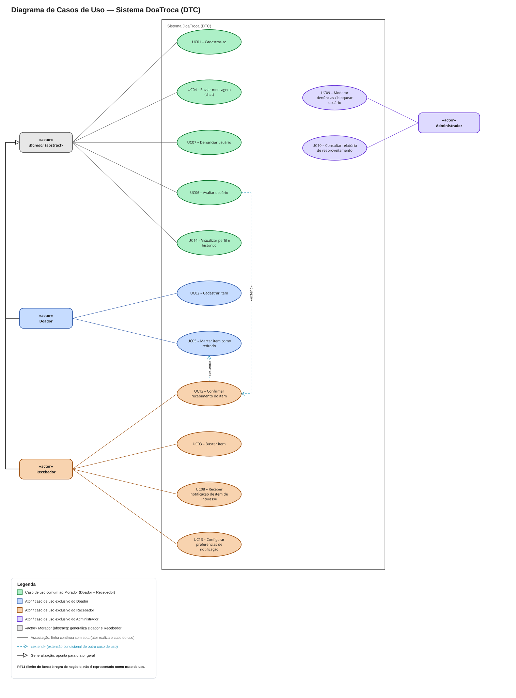

### 4.2 Descrição do diagrama

No diagrama da Figura 1, os atores são **Doador** e **Recebedor**, especializações do ator abstrato **Morador** (relação de generalização), e **Administrador**. Os atores usam a notação retangular da UML com a palavra-chave «actor», e o ator abstrato Morador é identificado pela propriedade {abstract} e pelo nome em itálico. Cada associação é uma linha contínua individual entre ator e caso de uso, e a generalização é uma linha contínua com triângulo vazado apontando para o ator geral. Os casos de uso foram levantados nas entrevistas e na sessão de validação V1 do protótipo (RF12, RF13 e RF14).

O caso de uso UC12 – Confirmar recebimento do item possui uma relação «extend» com UC05 – Marcar item como retirado: a confirmação bilateral da negociação estende a marcação de retirada feita pelo doador. Por sua vez, UC06 – Avaliar usuário estende UC12, representando a avaliação como uma etapa opcional que só pode ocorrer depois que o recebimento é confirmado. Não foi necessário o uso de «include», pois não há comportamento obrigatório compartilhado entre casos de uso.

### 4.3 Casos de uso e requisitos correspondentes

Cada caso de uso corresponde a um requisito funcional de mesmo número, conforme a Tabela 9. O
RF11 (limite de itens) é uma regra de negócio aplicada dentro do UC02 e, por isso, não é
representado como caso de uso próprio — não há UC11.

**Tabela 9 – Casos de uso e requisitos correspondentes**

| Caso de uso | Ator principal | Requisito | Relações |
|---|---|---|---|
| UC01 – Cadastrar-se | Morador | RF01 | — |
| UC02 – Cadastrar item | Doador | RF02, RF11 | — |
| UC03 – Buscar item | Recebedor | RF03 | — |
| UC04 – Enviar mensagem (chat) | Morador | RF04 | — |
| UC05 – Marcar item como retirado | Doador | RF05 | Estendido por UC12 |
| UC06 – Avaliar usuário | Morador | RF06 | «extend» UC12 |
| UC07 – Denunciar usuário | Morador | RF07 | — |
| UC08 – Receber notificação de item de interesse | Recebedor | RF08 | — |
| UC09 – Moderar denúncias / bloquear usuário | Administrador | RF09 | — |
| UC10 – Consultar relatório de reaproveitamento | Administrador | RF10 | — |
| UC12 – Confirmar recebimento do item | Recebedor | RF12 | «extend» UC05; estendido por UC06 |
| UC13 – Configurar preferências de notificação | Recebedor | RF13 | — |
| UC14 – Visualizar perfil e histórico | Morador | RF14 | — |

---

## 5. Protótipo de Interface

O protótipo de interface foi construído no Figma e está disponível em: **[abrir protótipo no Figma](https://www.figma.com/design/Ir08rnuZGgnQwQcxI73dYG/Prototipo---PI_II-B?node-id=0-1&t=i7wNcxpSjA3fGmta-1)**. Ele contém 14 telas que cobrem todos os requisitos funcionais com interação de usuário.

As telas seguem um design system único (paleta creme, verde-petróleo e terracota; componentes
padronizados de cabeçalho, botões, campos, cartões e barra de navegação inferior), descrito em
[`anexos/prototipo.md`](anexos/prototipo.md). A Tabela 10 relaciona cada tela aos requisitos e
casos de uso que ela atende; as telas aparecem na Figura 2, ao final desta seção.

**Tabela 10 – Telas do protótipo e requisitos atendidos**

| Tela | Descrição | Requisitos | Caso de uso |
|---|---|---|---|
| 01 – Cadastro / Login | Cadastro em uma única etapa (nome, bairro/rua, contato, senha) e acesso por login | RF01, RSEG01, RUSA01 | UC01 |
| 02 – Feed / Busca | Lista de itens com busca e filtros de categoria e proximidade | RF03, RPER01 | UC03 |
| 03 – Cadastrar item | Foto, título, categoria, descrição, estado de conservação e tipo (doação/troca); indicador de itens ativos no cabeçalho (ex.: 3/10) | RF02, RF11 | UC02 |
| 04 – Detalhe do item | Dados do item e do doador com reputação, botão "Tenho interesse" | RF03, RF04, RF14 | UC03, UC04, UC14 |
| 05 – Chat | Conversa 1:1 com aviso de local neutro e link de denúncia | RF04, RF07, RSEG01 | UC04, UC07 |
| 06 – Confirmar retirada | Doador marca o item como retirado | RF05 | UC05 |
| 07 – Avaliar usuário | Nota de 1 a 5 estrelas e comentário opcional | RF06 | UC06 |
| 08 – Denunciar usuário | Motivo da denúncia e descrição | RF07 | UC07 |
| 09 – Notificações | Avisos de novos itens nas categorias de interesse | RF08 | UC08 |
| 10 – Painel de moderação | Lista de denúncias, histórico da conversa, bloquear/arquivar | RF09 | UC09 |
| 11 – Relatório | Itens reaproveitados por mês, categorias, usuários ativos | RF10 | UC10 |
| 12 – Perfil | Dados, itens doados e nota média do usuário | RF14, RF06 | UC14 |
| 13 – Preferências de notificação | Seleção das categorias de interesse | RF13 | UC13 |
| 14 – Confirmar recebimento | Recebedor confirma ("Sim, recebi" / "Não recebi") | RF12 | UC12 |

O protótipo é navegável no modo de apresentação do Figma, com dois fluxos: **Morador**, que começa
na Tela 01, e **Administrador**, que começa na Tela 10. Fluxo de navegação principal do morador: Cadastro/Login (01) → Feed/Busca (02) → Detalhe do item
(04) → Chat (05) → Confirmar retirada (06) → Confirmar recebimento (14) → Avaliar usuário (07).
A partir do Feed, o morador acessa Publicar item (03), Notificações (09) e Perfil (12); do
Perfil, as Preferências de notificação (13); do Chat, a Denúncia (08). O administrador acessa o Painel de
moderação (10) e o Relatório (11).

A Figura 2 apresenta as 14 telas do protótipo, na mesma numeração da Tabela 10. Clique em uma
tela para abri-la em tamanho real.

**Figura 2 – Telas do protótipo**

| [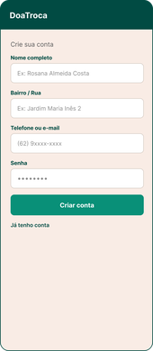](anexos/telas/tela-01.png) | [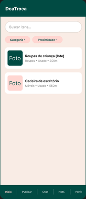](anexos/telas/tela-02.png) | [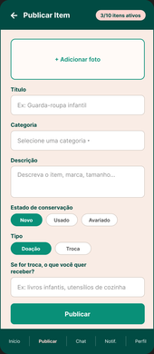](anexos/telas/tela-03.png) | [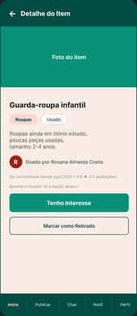](anexos/telas/tela-04.png) |
|:---:|:---:|:---:|:---:|
| **01** – Cadastro / Login | **02** – Feed / Busca | **03** – Cadastrar item | **04** – Detalhe do item |
| [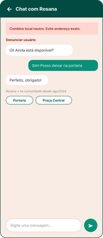](anexos/telas/tela-05.png) | [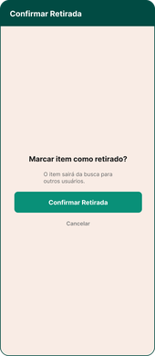](anexos/telas/tela-06.png) | [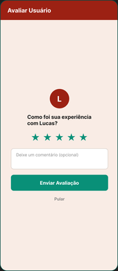](anexos/telas/tela-07.png) | [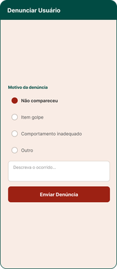](anexos/telas/tela-08.png) |
| **05** – Chat | **06** – Confirmar retirada | **07** – Avaliar usuário | **08** – Denunciar usuário |
| [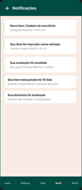](anexos/telas/tela-09.png) | [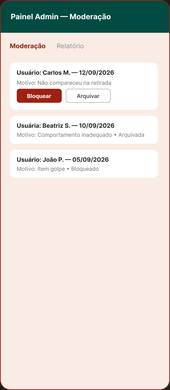](anexos/telas/tela-10.png) | [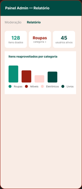](anexos/telas/tela-11.png) | [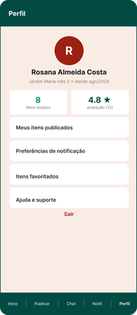](anexos/telas/tela-12.png) |
| **09** – Notificações | **10** – Painel de moderação | **11** – Relatório | **12** – Perfil |
| [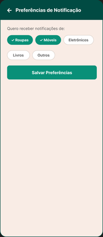](anexos/telas/tela-13.png) | [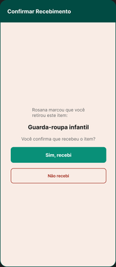](anexos/telas/tela-14.png) |   |   |
| **13** – Preferências de notificação | **14** – Confirmar recebimento |   |   |

---

## 6. Validação e Rastreabilidade

### 6.1 Metodologia de validação

Os requisitos e o protótipo foram apresentados aos stakeholders em duas sessões de validação
**simuladas**, com as mesmas personas das entrevistas (seção 2.4). Em cada sessão, o participante
percorreu as telas do protótipo executando as tarefas do seu perfil, e os requisitos
correspondentes foram lidos e comentados. Problemas e sugestões foram registrados e geraram as
alterações descritas na seção 6.3.

### 6.2 Sessões de validação

**Sessão V1 — Moradores (doadora e recebedor)**

**Tabela 11 – Registro da sessão de validação V1**

| Campo | Registro |
|---|---|
| **Data** | 12/09/2026 |
| **Participantes** | Rosana Almeida Costa (moradora doadora, pouca familiaridade com aplicativos); Lucas Ferreira Martins (morador recebedor, estudante) |
| **Requisitos avaliados** | RF01 a RF08, RUSA01, RSEG01 |
| **Telas avaliadas** | 01 a 09 |
| **Tarefas executadas** | Cadastrar-se, publicar um item, buscar um item, combinar a retirada pelo chat, marcar como retirado, avaliar e denunciar |
| **Problemas e sugestões** | (1) Lucas: "Quem garante que eu recebi mesmo? Só o doador marca como retirado." — apenas uma das partes encerrava a negociação. (2) Lucas: "Como o app sabe que eu quero eletrônico?" — não havia tela para escolher as categorias das notificações. (3) Rosana: "Eu queria ver a nota da pessoa antes de marcar o encontro." — a avaliação existia, mas não era visível antes da negociação. (4) Rosana aprovou o cadastro em uma única tela e o aviso de local neutro no chat. |
| **Alterações realizadas** | Criados RF12 (Tela 14), RF13 (Tela 13) e RF14 (Tela 12); alterados RF05, RF06 e RF08; diagrama de casos de uso atualizado com UC12, UC13 e UC14 e as relações «extend» |
| **Resultado** | Requisitos e telas aprovados com as alterações acima |

**Sessão V2 — Patrocinador**

**Tabela 12 – Registro da sessão de validação V2**

| Campo | Registro |
|---|---|
| **Data** | 02/10/2026 |
| **Participante** | Antônio Carlos Ribeiro (presidente da Associação de Moradores, patrocinador e administrador) |
| **Requisitos avaliados** | RF09, RF10, RF11; RF12, RF13 e RF14 (telas criadas após a V1); e a lista completa de requisitos não funcionais (RPER01, RUSA01, RUSA02, RPSW01, RDISP01, RSEG01) |
| **Telas avaliadas** | 10, 11, 12, 13 e 14; Tela 03 (indicador de itens ativos) |
| **Tarefas executadas** | Analisar uma denúncia e bloquear o usuário; consultar o relatório mensal; revisar as regras de uso; percorrer o fluxo retirada → confirmação de recebimento → avaliação e as telas de preferências e perfil |
| **Problemas e sugestões** | (1) O RF11 não definia o valor do limite, deixando o conflito com doadores em mudança em aberto; o patrocinador definiu 10 itens ativos por usuário. (2) Pediu atenção a moradores mais velhos e a quem usa celular com fonte grande. (3) Pediu que o sistema "não saia do ar", para não perder a confiança dos moradores. (4) Aprovou o painel de moderação e o relatório sem alterações. (5) Aprovou as telas 12, 13 e 14, criadas após a V1, sem alterações. |
| **Alterações realizadas** | RF11 alterado (limite de 10 itens; conflito resolvido); criados RUSA02 (acessibilidade), RDISP01 (disponibilidade) e RPER01 (desempenho, confirmado nesta sessão) |
| **Resultado** | Requisitos administrativos, telas criadas após a V1 e requisitos não funcionais aprovados com as alterações acima |

### 6.3 Registro de alterações

**Tabela 13 – Histórico de alterações dos requisitos**

| Data | Requisito | Alteração | Motivo |
|---|---|---|---|
| 12/09/2026 | RF01–RF11, RUSA01, RPSW01, RSEG01 | Criação | Entrevistas (Anexo A) |
| 12/09/2026 | RF12 | Criação | V1 — confirmação bilateral da entrega |
| 12/09/2026 | RF13 | Criação | V1 — escolha das categorias de notificação |
| 12/09/2026 | RF14 | Criação | V1 — visibilidade da reputação |
| 12/09/2026 | RF05, RF06, RF08 | Alteração de dependências | V1 — integração com RF12 e RF13 |
| 02/10/2026 | RF11 | Definição do limite (10 itens) | V2 — resolução do conflito registrado |
| 02/10/2026 | RPER01, RUSA02, RDISP01 | Criação | V2 e revisão do Anexo A |

### 6.4 Matriz de rastreabilidade

A matriz abaixo liga cada requisito à necessidade que o originou (seção 2.4), ao caso de uso
(seção 4), à tela do protótipo (seção 5) e à sessão em que foi validado.

**Tabela 14 – Matriz de rastreabilidade**

| Requisito | Necessidade | Caso de uso | Protótipo/Tela | Validado? |
|---|---|---|---|---|
| RF01 – Cadastro de usuário | N01 | UC01 – Cadastrar-se | Tela 01 | Sim – V1 |
| RF02 – Cadastro de item | N01 | UC02 – Cadastrar item | Tela 03 | Sim – V1 |
| RF03 – Busca por categoria e proximidade | N02 | UC03 – Buscar item | Telas 02 e 04 | Sim – V1 |
| RF04 – Chat interno | N03 | UC04 – Enviar mensagem | Telas 04 e 05 | Sim – V1 |
| RF05 – Marcar item como retirado | N04 | UC05 – Marcar item como retirado | Tela 06 | Sim – V1 |
| RF06 – Avaliação entre usuários | N05 | UC06 – Avaliar usuário | Tela 07 | Sim – V1 |
| RF07 – Denúncia de usuário | N06 | UC07 – Denunciar usuário | Telas 05 e 08 | Sim – V1 |
| RF08 – Notificação de item de interesse | N07 | UC08 – Receber notificação | Tela 09 | Sim – V1 |
| RF09 – Painel de moderação | N08 | UC09 – Moderar denúncias | Tela 10 | Sim – V2 |
| RF10 – Relatório de reaproveitamento | N09 | UC10 – Consultar relatório | Tela 11 | Sim – V2 |
| RF11 – Limite de itens por usuário | N10 | Regra de negócio do UC02 | Tela 03 (indicador de itens ativos) | Sim – V2 |
| RF12 – Confirmação de recebimento | N04 | UC12 – Confirmar recebimento | Tela 14 | Sim – V2 |
| RF13 – Preferências de notificação | N07 | UC13 – Configurar preferências | Tela 13 | Sim – V2 |
| RF14 – Perfil e histórico | N05 | UC14 – Visualizar perfil | Telas 04 e 12 | Sim – V2 |
| RPER01 – Tempo de resposta da busca | N13 | UC03 | Tela 02 | Sim – V2 |
| RUSA01 – Interface simples | N01, N11 | Todos | Todas | Sim – V1 |
| RUSA02 – Acessibilidade | N11 | Todos | Todas | Sim – V2 |
| RPSW01 – App móvel e web | N12 | Todos | Todas | Sim – V2 |
| RDISP01 – Disponibilidade contínua | N13 | Todos | — | Sim – V2 |
| RSEG01 – Login e proteção de contato | N03 | UC01, UC04 | Telas 01 e 05 | Sim – V1 |

---

## 7. Glossário

**Tabela 15 – Glossário**

| Palavra-chave | Descrição |
|---|---|
| Item | Objeto cadastrado por um usuário para doação ou troca |
| Doador | Usuário que oferece um item |
| Recebedor | Usuário interessado em um item ofertado |
| Categoria | Classificação do item (roupas, livros, móveis, eletrônicos, etc.) |
| Estado de conservação | Avaliação da condição física do item (novo, usado, avariado) |
| Negociação | Combinação entre doador e recebedor sobre entrega/retirada do item |
| Item ativo | Item publicado que ainda não foi marcado como retirado |
| Local neutro | Ponto público de encontro (portaria, praça) usado na retirada para preservar o endereço do morador |
| Persona | Representação de um perfil típico de usuário, usada nas entrevistas e na validação simuladas |
| Economia circular | Modelo que prolonga a vida útil dos produtos por meio de reutilização, reduzindo o descarte |

---

## 8. Referências

- PONTIFÍCIA UNIVERSIDADE CATÓLICA DE GOIÁS. **Modelo de Documento de Requisitos (DER)**. Projeto Integrador II-B. Goiânia: PUC Goiás, 2026.
- PONTIFÍCIA UNIVERSIDADE CATÓLICA DE GOIÁS. **Critérios de Avaliação do Documento de Requisitos**. Projeto Integrador. Goiânia: PUC Goiás, 2026.
- SOMMERVILLE, Ian. **Engenharia de Software**. 10. ed. São Paulo: Pearson, 2019.
- PRESSMAN, Roger S.; MAXIM, Bruce R. **Engenharia de Software: uma abordagem profissional**. 9. ed. Porto Alegre: AMGH, 2021.
- W3C. **Web Content Accessibility Guidelines (WCAG) 2.1**. 2018. Disponível em: https://www.w3.org/TR/WCAG21/.
- BRASIL. **Lei nº 12.305, de 2 de agosto de 2010**. Institui a Política Nacional de Resíduos Sólidos. Brasília, 2010.

---

## 9. Anexos

### Anexo A – Entrevistas simuladas

Entrevistas simuladas com dois moradores do bairro Jardim Maria Inês 2 (Goiânia-GO),
representando os dois perfis principais de usuário do sistema (doador e recebedor de
itens), e com o presidente da Associação de Moradores, patrocinador do sistema.

#### Entrevista 1 — Doadora

- **Nome:** Rosana Almeida Costa
- **Função/papel na comunidade:** Moradora há 20 anos do bairro Jardim Maria Inês 2
- **Data da entrevista:** 12/09/2026

**1. Hoje, quando você quer se desfazer de um item que ainda está em bom estado, o que costuma fazer com ele?**

> "Geralmente eu tento doar pra um brechó de uma igreja aqui perto, ou dou pra alguém da
> família. Mas móvel grande é mais complicado — às vezes fico sem saber pra quem oferecer
> e acabo colocando na calçada mesmo, pra ver se alguém leva, ou jogando fora."

**2. Já teve dificuldade para encontrar alguém interessado em um item que você queria doar?**

> "Já, sim. Tentei doar um guarda-roupa pequeno num grupo de WhatsApp do bairro, fiquei
> quase três semanas esperando alguém combinar de buscar. No fim ninguém apareceu e tive
> que descartar."

**3. Você acha que os moradores teriam interesse em um app para doar/trocar itens dentro do próprio bairro? Por quê?**

> "Acho que sim, desde que seja bem simples de usar. Eu não tenho paciência pra
> aplicativo complicado, com cadastro cheio de etapa. Se for fácil de tirar foto e
> publicar, eu uso."

**4. Que tipos de itens você imagina que mais circulariam?**

> "Roupa de criança com certeza, porque criança cresce rápido e a roupa ainda serve.
> Móveis pequenos também, tipo cadeira, mesinha. E eletrodoméstico que a gente troca por
> um novo mas o velho ainda funciona."

**5. Você teria receio de compartilhar seu endereço ou contato com estranhos do bairro?**

> "Teria, sim. Não daria meu endereço exato de cara. Prefiro combinar um lugar mais neutro,
> tipo a portaria de um condomínio ou uma praça, até eu conhecer a pessoa."

**6. Como você imagina que deveria funcionar a combinação de retirada do item?**

> "Acho que devia ter um jeito de marcar dia e horário dentro do próprio app, sem precisar
> passar meu telefone pessoal logo de cara."

**7. Quem, na sua visão, deveria poder moderar ou administrar o sistema?**

> "Eu gostaria que tivesse alguém responsável, tipo o síndico ou um morador voluntário,
> pra resolver se der problema. E acho importante ter uma forma de avaliar as pessoas,
> tipo nota, pra saber se dá pra confiar."

**8. Existe alguma iniciativa parecida que já funcionou ou foi tentada aqui?**

> "Tem um grupo de WhatsApp do bairro que no começo bombou bastante, todo mundo postando
> item. Mas virou bagunça — não tinha categoria, as mensagens se perdiam rápido e ninguém
> achava mais nada depois de um dia."

#### Entrevista 2 — Recebedor

- **Nome:** Lucas Ferreira Martins
- **Função/papel na comunidade:** Estudante, mora no bairro Jardim Maria Inês 2 há 2 anos
- **Data da entrevista:** 12/09/2026

**1. Hoje, quando você quer se desfazer de um item que ainda está em bom estado, o que costuma fazer com ele?**

> "Eu sou mais do lado de procurar item usado do que doar, mas quando preciso, procuro em
> grupo de Facebook ou de bairro no WhatsApp, ou às vezes no OLX. É mais difícil achar
> coisa perto de casa mesmo."

**2. Já teve dificuldade para encontrar alguém interessado em um item que você queria [obter]?**

> "Já perdi um item porque demorei pra responder a pessoa e ela já tinha dado pra outra.
> E teve vez que combinei de buscar um item e quando cheguei lá já não tinha mais."

**3. Você acha que os moradores teriam interesse em um app para doar/trocar itens dentro do próprio bairro? Por quê?**

> "Com certeza, principalmente se tiver filtro por categoria e por proximidade. Eu queria
> receber notificação quando aparecer algo que eu tô procurando, tipo eletrônico ou
> móvel."

**4. Que tipos de itens você imagina que mais circulariam?**

> "Eletrônico, móvel pra montar apartamento — eu mesmo montei o meu quase todo com coisa
> usada — e livro técnico da faculdade também."

**5. Você teria receio de compartilhar seu endereço ou contato com estranhos do bairro?**

> "Concordo com isso, sim. Prefiro que o combinado seja tudo dentro de um chat do próprio
> app, sem precisar passar meu número de telefone antes de confiar na pessoa."

**6. Como você imagina que deveria funcionar a combinação de retirada do item?**

> "Marcar hora e local pelo chat mesmo, e depois que eu peguei o item, o sistema já devia
> marcar como 'retirado' pra sumir da lista pra outras pessoas não perderem tempo indo
> atrás de algo que já foi."

**7. Quem, na sua visão, deveria poder moderar ou administrar o sistema?**

> "Acho legal ter uma reputação de usuário, tipo estrelinha, e um jeito de denunciar
> alguém que marcou e não apareceu."

**8. Existe alguma iniciativa parecida que já funcionou ou foi tentada aqui?**

> "Tem uma feira de trocas que acontece uma vez por ano na praça do bairro, mas é só uma
> vez, não resolve quando eu preciso de algo no meio do ano."

#### Entrevista 3 — Patrocinador

- **Nome:** Antônio Carlos Ribeiro
- **Função/papel na comunidade:** Presidente da Associação de Moradores do bairro Jardim Maria Inês 2
- **Data da entrevista:** 12/09/2026

**1. Como você enxerga o problema do descarte de itens ainda úteis no bairro hoje?**

> "É bem comum, principalmente perto de mudança ou reforma. A gente vê muito móvel e
> eletrodoméstico ainda bom largado na calçada esperando o caminhão de lixo. É um
> desperdício que dá pra evitar."

**2. Os moradores aderiram bem a iniciativas parecidas no passado, como o grupo de WhatsApp ou a feira de trocas? O que faltou?**

> "O grupo de WhatsApp teve um pico de uso e depois morreu, porque virou zoeira e
> mensagem repetida, ninguém aguentava acompanhar. A feira de trocas funciona, mas é só
> uma vez por ano, não dá pra depender só dela."

**3. Que benefício você, como representante da associação, esperaria ver com um sistema assim?**

> "Eu gostaria de conseguir mostrar pra comunidade, com número mesmo, quantos itens foram
> reaproveitados em vez de virarem lixo. Isso ajuda até a gente pleitear parceria com a
> prefeitura ou com projetos de sustentabilidade."

**4. Você estaria disposto a atuar como administrador/moderador do sistema? O que isso implicaria pra você?**

> "Toparia, mas só se não desse muito trabalho. Eu precisaria de um jeito fácil de ver
> denúncia e resolver rápido, não quero ficar checando aplicativo toda hora."

**5. Que tipo de relatório ou informação você gostaria de acompanhar?**

> "Quantidade de itens doados por mês, quais categorias saem mais, e se possível quantos
> usuários ativos a gente tem. Isso me ajuda a apresentar resultado nas reuniões de
> condomínio/associação."

**6. Você vê necessidade de regras específicas, tipo limite de itens por usuário ou verificação de identidade?**

> "Acho bom ter um limite pra não virar bagunça de gente publicando anúncio de venda
> disfarçado de doação. Verificação de identidade eu não acho necessário no início, pode
> complicar o cadastro."

**7. Como você imagina lidar com denúncias ou problemas entre moradores?**

> "Gostaria de receber a denúncia num painel simples, ver o histórico da conversa se
> precisar, e poder bloquear o usuário se for grave."

**8. Tem algum receio ou resistência que você imagina que a comunidade teria com esse tipo de sistema?**

> "Alguns moradores mais velhos podem estranhar, mas se for simples eu acho que pega bem.
> O maior receio mesmo é gente usando pra vender item fingindo que é doação, ou item
> golpe."

#### Observações do entrevistador — requisitos identificados

- Cadastro e publicação de item precisam ser **simples e rápidos** (poucas etapas, foto
  fácil) → requisito de usabilidade.
- Itens sem retirada combinada em muito tempo acabam sendo descartados mesmo assim →
  reforça a importância de **busca por proximidade/categoria** para dar visibilidade
  rápida ao item.
- **Não expor endereço/telefone diretamente** — combinação deve ocorrer por chat interno
  ao app, com local neutro sugerido pelo doador → requisito de segurança/privacidade.
- Precisa de forma de **marcar item como retirado/concluído** para sair da listagem e
  evitar frustração de quem chega atrasado.
- **Sistema de avaliação/reputação** entre usuários e possibilidade de denúncia →
  aumenta confiança na comunidade.
- Demanda por **notificação** quando surge item de categoria de interesse do usuário.
- Soluções informais atuais (grupo de WhatsApp, feira anual) falham por falta de
  organização por categoria e por serem esporádicas/temporárias — reforça a proposta de
  um sistema contínuo e categorizado.
- O patrocinador quer um **painel/relatório com métricas** (itens doados por mês,
  categorias mais comuns, usuários ativos) — liga diretamente ao argumento de
  sustentabilidade do sistema, dando números concretos de reaproveitamento.
- Precisa de **painel de moderação simples** para o administrador tratar denúncias e
  bloquear usuários, sem exigir acompanhamento constante.
- **Limite de itens publicados por usuário** para evitar uso indevido do sistema como
  vitrine de venda disfarçada de doação.
- Verificação de identidade **não é desejada** no cadastro inicial — o patrocinador
  considera que aumentaria a fricção sem necessidade clara agora.

### Anexo B – Telas do protótipo

Protótipo interativo: **[abrir no Figma](https://www.figma.com/design/Ir08rnuZGgnQwQcxI73dYG/Prototipo---PI_II-B?node-id=0-1&t=i7wNcxpSjA3fGmta-1)**. As 14 telas estão
reproduzidas na Figura 2 (seção 5), e a relação entre cada tela e os requisitos atendidos está
na Tabela 10. A descrição de cada tela e do design system está em [`anexos/prototipo.md`](anexos/prototipo.md), e as imagens em tamanho real, em [`anexos/telas/`](anexos/telas/).
